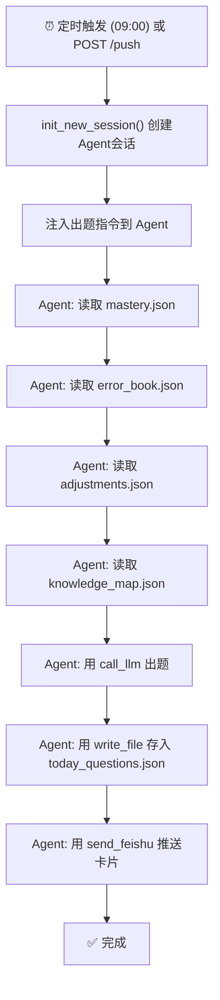
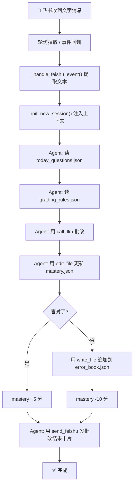
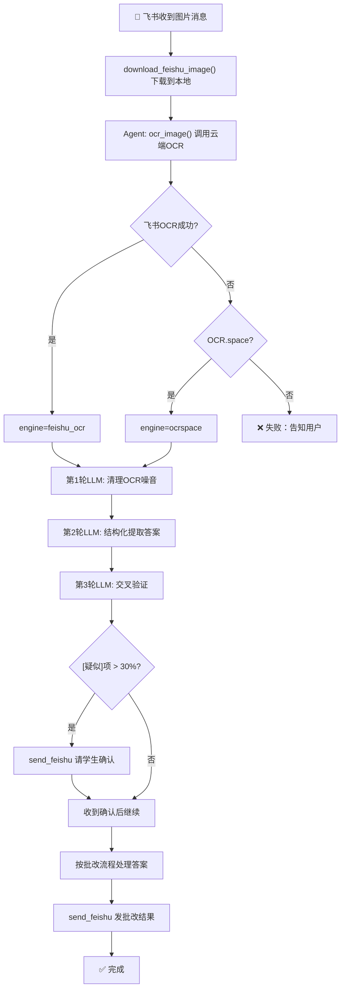
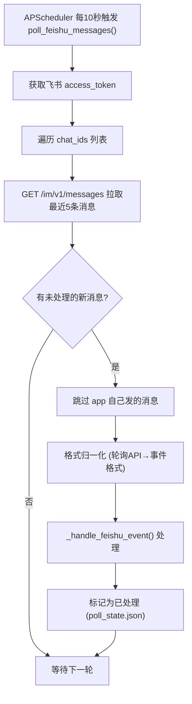
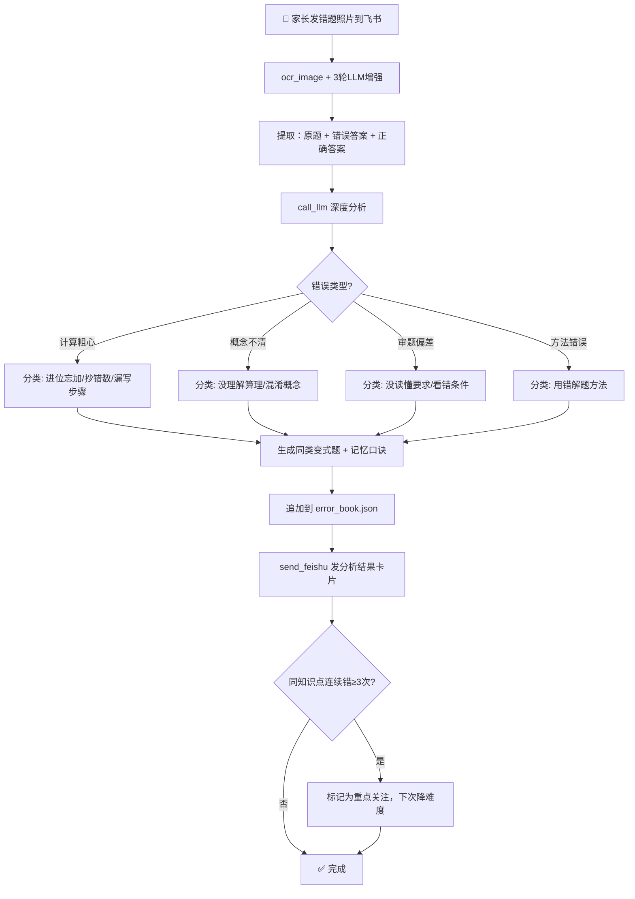

# 🐱 小肥猫学习助手 v2.9 — 项目完整手册

> 最后更新：2026-06-04 09:31 | 工作空间：`/Users/mindy/CodeBuddy/20260521173149/cat-learning`
> GitHub: `git@github.com:mindywang19871129/cat-learning.git`
>
> **变更记录**：见 Git 提交历史。每次变更同步更新本文档。
>
> **当前部署状态**：代码 v2.11 | DeepSeek V4 Pro ✅ | 飞书 ✅ | OCR.space ✅ | 家长密码 ✅ | 📚联网搜教材 | 🔬错题本分析 | 🎯飞书动态调整 | 📖 KET备考体系(v2.6) | 📅历史题目匹配(v2.10) | 🔧多worker防重复出题(v2.11) | 📝KET题型格式模板(v2.11) | 🎉 全链路就绪

---

## 一、项目概览

**小肥猫学习助手**是一个基于 LLM Agent 的小学生 AI 辅导系统，通过**飞书机器人**与家长/学生交互。核心能力是：DeepSeek V4 Pro 驱动出题 + 飞书云端 OCR 批改手写答案 + 艾宾浩斯记忆曲线错题管理。

```
┌─────────────────────────────────────────────────────────────────┐
│                      飞书客户端                                  │
│               (手机/电脑，家长和小朋友使用)                        │
└──────────────┬──────────────────────────────────────────────────┘
               │ 文字消息 / 图片消息
               ▼
┌─────────────────────────────────────────────────────────────────┐
│              飞书开放平台 API                                     │
│   ┌─────────────┐  ┌──────────────┐  ┌─────────────────────┐   │
│   │ 消息轮询拉取 │  │ 消息发送 API  │  │ OCR 图片识别 API     │   │
│   │ (内网无公网IP)│  │ (文本/卡片)   │  │ optical_char_recog. │   │
│   └──────┬───────┘  └──────┬───────┘  └──────────┬──────────┘   │
└──────────┼─────────────────┼─────────────────────┼──────────────┘
           │                 │                     │
           ▼                 ▼                     ▼
┌─────────────────────────────────────────────────────────────────┐
│              你的服务器 (Ubuntu, 内网)                             │
│                                                                   │
│   ┌─────────────────────────────────────────────────────────┐   │
│   │ server.py (Flask)                                       │   │
│   │  ├─ /health       健康检查                                │   │
│   │  ├─ /push        手动触发出题                              │   │
│   │  ├─ /feishu/event 飞书事件回调                            │   │
│   │  ├─ /feishu/poll  手动轮询                                │   │
│   │  ├─ /feishu/config 轮询配置                               │   │
│   │  ├─ /admin/init   密码初始化                               │   │
│   │  ├─ /admin/adjust 家长调参                                │   │
│   │  └─ /admin/report 学习报告                                │   │
│   └─────────────────────────────────────────────────────────┘   │
│                           │                                       │
│                           ▼                                       │
│   ┌─────────────────────────────────────────────────────────┐   │
│   │ core.py — LLM Agent Loop                                │   │
│   │                                                        │   │
│   │  10个工具:                                              │   │
│   │  read_file / write_file / edit_file / list_dir          │   │
│   │  bash / ask_user / call_llm / web_search               │   │
│   │  ocr_image / send_feishu                                │   │
│   │                                                        │   │
│   │  LLM自主决策 → 调工具 → 读写数据 → 推送飞书              │   │
│   └─────────────────────────────────────────────────────────┘   │
│                           │                                       │
│                           ▼                                       │
│   ┌─────────────────────────────────────────────────────────┐   │
│   │ root.md — 系统提示词（Agent的「大脑」）                   │   │
│   │  - 角色定义：小猫老师，8-9岁小学生                        │   │
│   │  - 8条教育铁律                                            │   │
│   │  - 出题/批改/图片处理/家长管理 流程SOP                    │   │
│   │  - 飞书消息格式规范                                        │   │
│   └─────────────────────────────────────────────────────────┘   │
│                           │                                       │
│                           ▼                                       │
│   ┌─────────────────────────────────────────────────────────────┐│
│   │ data/  数据目录 (运行时创建，不在Git中)                       ││
│   │  ├─ knowledge_map.json   知识体系 (数学7单元 + 英语KET)       ││
│   │  ├─ mastery.json         34个知识点掌握度 (0-100)             ││
│   │  ├─ error_book.json      错题本 (含时间戳/复习次数)           ││
│   │  ├─ adjustments.json     家长调参 (题数/难度/密码)            ││
│   │  ├─ grading_rules.json   批改规则 (10条)                      ││
│   │  ├─ ket_plan.md          KET 108天备考计划                    ││
│   │  ├─ today_questions.json 今日题目                             ││
│   │  ├─ sessions/            Agent对话历史                        ││
│   │  └─ images/              飞书下载的图片缓存                    ││
│   └─────────────────────────────────────────────────────────────┘│
└───────────────────────────────────────────────────────────────────┘
           │
           ▼
┌─────────────────────────────────────────────────────────────────┐
│                    外部 API 依赖                                 │
│                                                                   │
│  ┌──────────────────┐  ┌──────────────────────────┐                      │
│  │ DeepSeek API      │  │ OCR.space (推荐备用)      │                     │
│  │ api.deepseek.com  │  │ api.ocr.space            │                     │
│  │ 需 DEEPSEEK_API_KEY│  │ 需 OCR_SPACE_API_KEY     │                     │
│  └──────────────────┘  │ 免费 25000次/月 ✨        │                     │
│                        └──────────────────────────┘                     │
│                                                                   │
│  ┌──────────────────┐                                             │
│  │ Tavily 搜索 (备用) │                                            │
│  │ api.tavily.com    │                                            │
│  │ 需 TAVILY_API_KEY │                                            │
│  └──────────────────┘                                             │
└─────────────────────────────────────────────────────────────────┘
```

---

## 二、完整功能列表

### 2.1 学生端（飞书聊天）

| 功能 | 触发方式 | 说明 |
|------|---------|------|
| 📝 **每日出题** | 自动(09:00) 或 飞书说"发一套新题" | 数学4题(按7单元范围) + KET英语4题(按备考阶段，写作35%/词汇25%/语法20%)，自动归档到 `data/questions/questions_YYYY-MM-DD.json` |
| ✏️ **文字答题批改** | 发消息如"第1题答案是42" | LLM 查找题目→批改→更新掌握度→回复结果 |
| 📅 **历史题目批改** | 发消息如"29号第1题答案是42" | 自动用 `find_questions(date_hint="29号")` 查找历史题目→批改→更新掌握度 |
| 📸 **拍照答题批改** | 发图片 | 飞书OCR识别→3轮LLM增强清洗→批改→回复 |
| ⛔ **完成才能出新题** | Python层强制拦截 | 当前题目有未批改的（无 score 字段），拒绝出新题，提示先完成 |
| 🔁 **艾宾浩斯复习** | 自动融入出题 | 按1/2/4/7/15天间隔自动安排错题复习 |
| 🔬 **错题本分析** | 家长发错题照片 | OCR提取→LLM分析错误类型(粗心/概念/审题/方法)→变式题→记忆口诀 |
| 📊 **学习报告** | 发"查看学习报告" | 汇总掌握度/错题/薄弱点分析 |
| 📝 **模考** | 发"来一次模考" | 生成完整试卷(数学60分钟/KET 60+30分钟) |
| ⛔ **前一天未完成不出后一天** | 定时推送前自动检查 | today_questions.json 有未批改题目则跳过当天推送 |

### 2.2 家长端

| 功能 | 方式 | 说明 |
|------|------|------|
| 🔒 **密码管理** | `POST /admin/init` | 设置家长管理密码 |
| ⚙️ **调整难度** | 飞书发"调整难度 easy/normal/hard" | 需密码验证 |
| 📈 **调整题数** | 飞书发"每天出5道数学题" | 需密码验证 |
| 📚 **更换教材** | 飞书发"更换教材为人教版四下" | 需密码验证，LLM联网搜知识点自动生成，不对再上传 |
| 🎓 **调整年级** | 飞书发"调整年级为四年级" | 需密码验证，LLM联网搜知识点自动生成 |
| 🎯 **动态调整** | 飞书发"增加XX练习"/"减少XX"/"生成错题复习" | 需密码验证，LLM自主修改 adjustments.json |
| 📋 **查看报告** | `GET /admin/report?password=xxx` 或飞书发 | 完整学习分析（含错题类型统计） |
| 🎛️ **其他调参** | `POST /admin/adjust` | 批量调整设置 |

### 2.3 系统能力

| 能力 | 说明 |
|------|------|
| 🧠 **LLM Agent Loop** | DeepSeek V4 Pro 驱动，最多30轮工具调用自主完成任务 |
| 🛡️ **Python层前置拦截** | 发题/定时推送前由Python代码快速检查完成状态，不依赖LLM，保证必有回复 |
| 🔧 **11个内置工具** | read_file/write_file/call_llm/ocr_image/send_feishu/find_questions... |
| 📡 **消息轮询模式** | 内网无公网IP，服务器主动拉取飞书聊天消息 |
| 📎 **文件上传处理** | 支持PDF/图片文件上传，自动OCR/PDF解析提取内容 |
| 📚 **教材智能识别** | 换教材→LLM联网搜索知识点→自动生成知识体系，不对再上传校正 |
| 🔬 **错题深度分析** | 学校错题上传→OCR提取→4种错误类型归类→同类变式题→记忆口诀 |
| 📖 **KET备考体系** | 三阶段108天计划，A2语法7点+~1100词，读写听说35/15/25/25 |
| 🎯 **飞书动态调整** | 家长通过飞书自然语言指令调整题库配置，无需重启服务 |
| 🩻 **纯云端OCR** | 飞书OCR(主力) → OCR.space(备用)，无需本地安装 |
| 📅 **定时调度** | APScheduler，每日09:00自动出题推送 |
| 🔄 **systemd 守护** | 崩溃自动重启，开机自启 |

---

## 三、依赖项完整清单

### 3.1 外部 API Token（必须有效）

| Token | 用途 | 获取方式 | 失效影响 |
|-------|------|---------|---------|
| **DEEPSEEK_API_KEY** | 🔴 核心：LLM出题/批改/对话 | [platform.deepseek.com](https://platform.deepseek.com) 注册获取 | **整个系统不可用** |
| **FEISHU_APP_ID** | 🔴 核心：飞书API认证 | [open.feishu.cn](https://open.feishu.cn) 创建企业自建应用 | 无法收发飞书消息 |
| **FEISHU_APP_SECRET** | 🔴 核心：飞书API密钥 | 同上，应用凭证页面 | 无法收发飞书消息 |

### 3.2 飞书权限（需在开放平台开通）

| 权限 | 用途 | 开通路径 |
|------|------|---------|
| **optical_char_recognition** | 🟡 OCR图片识别 | 开放平台→权限管理→搜索开通→发布新版本 |
| **im:message** | 🟡 读取消息 | 开放平台→权限管理 |
| **im:message:send_as_bot** | 🟡 发送消息 | 开放平台→权限管理 |

### 3.3 可选 API Token（推荐注册，避免单点故障）

| Token | 用途 | 获取方式 | 失效影响 |
|-------|------|---------|---------|
| **OCR_SPACE_API_KEY** | 🟡 **强烈推荐** OCR降级备用 | [ocr.space/ocrapi](https://ocr.space/ocrapi) 免费注册，**每月25000次**，填邮箱即得Key | 飞书OCR频率限制时无备用（见下方3.7节） |
| **TAVILY_API_KEY** | 🟢 联网搜索降级 | [tavily.com](https://tavily.com) 注册 | 无法联网搜题（影响小） |

> ⚠️ **重要**：飞书OCR免费额度存在严格频率限制（实测约1次/分钟），频繁调用会触发 `99991400` 错误。代码已内置5次退避重试（10s/20s/30s/40s），但**强烈建议注册 OCR.space 作为稳定降级方案**。详见下方 3.7 节。

### 3.4 服务器依赖

| 组件 | 版本要求 | 用途 |
|------|---------|------|
| Ubuntu | 20.04+ | 操作系统 |
| Python | 3.10+ | 运行环境 |
| Git | 2.x | 代码拉取/更新 |
| systemd | 系统自带 | 服务守护 |
| gunicorn | 21.0+ | WSGI服务器 |

### 3.5 Python 依赖 (requirements.txt)

| 包 | 用途 |
|----|------|
| `openai>=1.0.0` | DeepSeek API调用 |
| `flask>=3.0.0` | Web服务器 |
| `gunicorn>=21.0.0` | 生产级WSGI |
| `apscheduler>=3.10.0` | 定时任务(每日出题/消息轮询) |
| `requests>=2.31.0` | HTTP客户端(飞书API/OCR) |
| `pillow>=10.0.0` | 图片处理 |
| `tomli>=2.0.0` | TOML配置解析(Python<3.11) |

### 3.6 依赖关系总图

```
cat-learning 可用性 = 
    DEEPSEEK_API_KEY 有效 
    AND FEISHU_APP_ID+SECRET 有效 
    AND 飞书权限(im:message + optical_char_recognition) 已开通
    AND 服务器网络能访问 api.deepseek.com + open.feishu.cn
    AND Python 3.10+

降级路径:
    飞书OCR频率限制(99991400) → 5次退避重试(10s递增) → 仍失败 → OCR.space (需 OCR_SPACE_API_KEY) → 均失败 → 提示用户
    DeepSeek搜索失败 → Tavily (需 TAVILY_API_KEY)
    事件回调不可用 → 轮询模式 (内网默认)
```

### 3.7 OCR 频率限制说明

**飞书 OCR API 免费额度有严格频率限制**，实测约 **1次/分钟**。连续多次调用会返回 `99991400 "request trigger frequency limit"`。

代码处理策略（`core.py` `_recognize_via_feishu`）：
- 遇到 99991400 → 自动退避重试，最多 **5次**（10s → 20s → 30s → 40s 递增等待）
- 日志输出到 stderr，不污染 stdout（避免脚本 JSON 解析被干扰）
- 5次重试全部失败 → 降级到 OCR.space

**长期稳定方案**：注册 OCR.space 免费 API Key（每月25000次，不受飞书频率限制），在 `.env` 中配置 `OCR_SPACE_API_KEY` 即可自动激活双引擎降级。

---

## 四、项目文件清单

```
cat-learning/
├── core.py              ← 🔴 Agent核心：LLM Loop + 10个工具
├── server.py            ← 🔴 Flask服务器：路由/轮询/定时
├── root.md              ← 🔴 系统提示词：Agent的「大脑」
├── config.toml          ← 🟡 运行配置（难度/题数/时间/轮询等）
├── .env                 ← 🔴 密钥（不在Git中，从.env.example创建）
├── .env.example         ← 🟡 密钥模板
├── requirements.txt     ← 🟡 Python依赖
├── deploy.sh            ← 🟢 一键部署脚本
├── cat-learning.service ← 🟢 systemd服务定义
├── test.sh              ← 🟢 端到端测试脚本
├── verify_all.sh        ← 🟢 全链路7步验证（服务/Token/OCR/LLM/轮询/数据）
├── debug_ocr.sh         ← 🟢 OCR深度诊断（打印飞书API完整返回码）
├── DEPLOY.md            ← 🟢 部署指南
├── VERIFY.md            ← 🟢 验证指南
├── PROJECT_GUIDE.md     ← 🟢 本文档
├── .gitignore           ← 排除 .env/data/__pycache__
├── methods/             ← 🟢 教育方法论参考 (Agent可读取)
│   ├── bloom.md
│   ├── constructivism.md
│   ├── ebbinghaus.md
│   ├── habit.md
│   ├── multi_intelligence.md
│   ├── piaget.md
│   ├── trial_error.md
│   └── vygotsky.md
└── tools/               ← 🟢 工具扩展目录
    └── __init__.py

运行时生成（data/，不在Git中）:
data/
├── knowledge_map.json
├── mastery.json
├── error_book.json
├── adjustments.json
├── grading_rules.json
├── ket_plan.md
├── today_questions.json
├── questions/          历史题目存档（按日期归档）
│   └── questions_YYYY-MM-DD.json
├── sessions/
├── images/
└── notes/
```

---

## 五、操作指引

### 5.0 部署后首次配置（必做，仅一次）

部署完成后，需完成以下3项配置才能长期稳定运行：

**① 激活 OCR.space 降级引擎（防飞书频率限制）**

访问 [ocr.space/ocrapi](https://ocr.space/ocrapi) 免费注册，填邮箱即得 API Key（每月25000次），然后：

```bash
echo 'OCR_SPACE_API_KEY=你的Key' >> /opt/cat-learning/.env
```

飞书OCR频率限制时自动切换到此引擎，不再出现 `engine=none`。

**② 设置家长管理密码**

```bash
curl -X POST http://localhost:8192/admin/init \
  -H "Content-Type: application/json" \
  -d '{"password": "你的密码（至少4位）"}'
# 返回: {"code":0,"msg":"初始化成功，密码已设置"}
```

密码 SHA256 哈希存储在 `data/adjustments.json`，后续通过飞书调参时需要验证。

**③ 全链路验证**

```bash
bash /opt/cat-learning/verify_all.sh
# 期望：全部7步通过（第4步 OCR 至少一个引擎成功）
```

完成后系统即进入长期稳定运行状态，无需额外操作。

---

### 5.1 日常使用

```bash
# 查看服务状态
systemctl status cat-learning

# 查看实时日志
journalctl -u cat-learning -f

# 健康检查
curl http://localhost:8192/health

# 手动触发今日出题（不等09:00）
curl -X POST http://localhost:8192/push

# 手动触发消息轮询
curl -X POST http://localhost:8192/feishu/poll
```

### 5.2 如何调整设置

**方式A：直接改 config.toml（改完重启）**

```bash
vim /opt/cat-learning/config.toml
# 可改的项：
#   每日题数: math_daily_count / english_daily_count
#   推送时间: push_time (如 "08:00")
#   出题难度: difficulty_bias (easy/normal/hard)
#   掌握度阈值: mastery.mastered / learning / weak
#   轮询间隔: poll.interval_seconds
#   轮询聊天: poll.chat_ids

systemctl restart cat-learning
```

**方式B：通过飞书发指令（推荐，无需重启）**

在飞书给机器人发（需要先设过密码）：
- `调整难度 easy` → 降低题目难度
- `每天出5道数学题` → 修改题数
- `查看学习报告` → 获取当前学习分析
- `查看错题分析` → 按错误类型(粗心/概念/审题/方法)统计
- `增加XX知识点练习` → 提高该知识点出题权重
- `生成错题复习` → 按艾宾浩斯曲线拉取该复习的错题
- 传错题照片 → 自动触发错题分析+同类变式题

**方式C：通过飞书指令换教材/年级（v2.4优化：先联网搜，无需上传）**

```bash
# 1. 在飞书给机器人发（需密码验证）
"更换教材为人教版四年级下册 密码631789"

# 2. 系统自动执行：
#    - 用 web_search 联网搜索该教材的知识体系
#    - 用 LLM 整理为 knowledge_map.json
#    - 重置 mastery.json + error_book.json
#    - 发送结果报告（含知识体系概要）

# 3. 如果自动生成的知识体系有误：
#    - 将教材目录拍照或传PDF发给机器人
#    - 系统会自动对比修正
```

**核心变化（v2.4）**：不再强制要求上传教材文件。LLM 先联网搜索知识点自动生成知识体系，只在自动结果不对时才需要上传文件修正。

**方式D：通过 HTTP API**

```bash
# 调整设置
curl -X POST http://localhost:8192/admin/adjust \
  -H "Content-Type: application/json" \
  -d '{"password":"你的密码","action":"调整难度","params":{"difficulty":"easy"}}'

# 查看报告
curl "http://localhost:8192/admin/report?password=你的密码"
```

### 5.3 代码更新流程

```bash
cd /opt/cat-learning
git fetch origin main && git reset --hard origin/main
bash deploy.sh
```

### 5.4 添加新功能

| 改什么 | 改哪个文件 | 说明 |
|--------|-----------|------|
| 修改Agent行为 | `root.md` | 系统提示词，改流程/约束/风格。关键节：教材知识体系(出题边界)、工作方式(数据+流程)、错题本分析(第5节)、飞书动态调整(第9节) |
| 添加新工具 | `core.py` TOOLS字典 + TOOL_SCHEMAS | 然后LLM就能自动发现使用 |
| 添加新API路由 | `server.py` | 标准Flask路由 |
| 修改定时任务 | `server.py` scheduled_daily_push() | 改推送逻辑 |
| 调整教育参数 | `config.toml` [education]段 | 无需改代码 |
| 修改飞书集成 | `config.toml` [feishu]段 | 改轮询/回调配置 |
| 添加教育方法 | `methods/`目录 | 放参考文档，Agent可read_file读取 |

---

## 六、工作流详解

### 6.1 每日出题流程



### 6.2 文字答题批改流程



### 6.3 图片OCR批改流程（3轮LLM增强管线）



### 6.4 消息轮询流程



### 6.5 错题本分析流程（v2.5新增）



---

## 七、故障排查完整指南

### 7.1 服务不启动

```bash
# 1. 检查状态
systemctl status cat-learning

# 2. 手动前台启动看报错
source /opt/venv/bin/activate
cd /opt/cat-learning
gunicorn server:app --bind 0.0.0.0:8192 --workers 2

# 3. 常见原因
# - .env 不存在或 DEEPSEEK_API_KEY 未设置
# - Python依赖未安装: pip install -r requirements.txt
# - 端口被占用: lsof -i :8192
```

### 7.2 飞书收不到消息

```bash
# 1. 测试飞书API连通性
TOKEN=$(curl -s -X POST 'https://open.feishu.cn/open-apis/auth/v3/tenant_access_token/internal' \
  -H 'Content-Type: application/json' \
  -d "{\"app_id\":\"$FEISHU_APP_ID\",\"app_secret\":\"$FEISHU_APP_SECRET\"}" | python3 -c "import sys,json; print(json.load(sys.stdin).get('tenant_access_token','FAIL'))")
echo "Token: ${TOKEN:0:20}..."

# 2. 手动触发轮询
curl -X POST http://localhost:8192/feishu/poll

# 3. 检查轮询配置
curl http://localhost:8192/feishu/config

# 4. 查看轮询日志
journalctl -u cat-learning --no-pager | grep "POLL"

# 5. 检查 chat_id 是否正确（去飞书给机器人发消息，然后查看日志找 chat_id）
```

### 7.3 OCR 识别失败

**快速诊断**（打印飞书API完整返回）：
```bash
bash /opt/cat-learning/debug_ocr.sh
```

**常见错误码与修复**：

| 错误码 | 含义 | 修复 |
|--------|------|------|
| `99991400` | 频率限制 | 等1-2分钟重试；注册 OCR.space 做长期降级 |
| `9499` | 权限未开通 | 飞书开放平台→权限管理→开通 optical_char_recognition→**发布新版本** |
| `99991672` | 应用未发布 | 飞书开放平台→点击「发布新版本」 |

**手动测试OCR（含重试）**：
```bash
python3 -c "
import sys, json
sys.path.insert(0, '/opt/cat-learning')
from core import ocr_image
from PIL import Image, ImageDraw
img = Image.new('RGB', (400, 100), 'white')
ImageDraw.Draw(img).text((20, 30), '12÷4=3', fill='black')
img.save('/tmp/test_ocr.png')
r = json.loads(ocr_image('/tmp/test_ocr.png'))
print(json.dumps(r, ensure_ascii=False, indent=2))
"
# 期望: engine=feishu_ocr, success=true（或 engine=ocrspace 降级成功）
```

**长期稳定方案**：
1. 访问 https://ocr.space/ocrapi 注册免费API Key
2. 在 `/opt/cat-learning/.env` 添加：`OCR_SPACE_API_KEY=你的key`
3. 重启服务：`systemctl restart cat-learning`
4. 此后飞书OCR限流时自动降级到 OCR.space（每月25000次免费）

### 7.4 DeepSeek API 不通

```bash
# 测试 API Key
curl -s https://api.deepseek.com/v1/models \
  -H "Authorization: Bearer $DEEPSEEK_API_KEY" | python3 -m json.tool

# 如果返回 401: API Key 无效或过期
# 如果超时: 检查服务器能否访问 api.deepseek.com
# 如果返回模型列表: 正常
```

### 7.5 出题但内容为空

```bash
# 看LLM日志
tail -50 /var/log/cat-learning.log

# 常见原因:
# - data/ 目录下缺少 knowledge_map.json 等基础数据文件
# - DeepSeek API 余额不足
# - LLM调用超时 (检查网络延迟)
```

---

## 八、飞书OCR验证测试

### 8.1 测试脚本（在服务器执行）

```bash
#!/bin/bash
echo "========================================="
echo "  小肥猫学习助手 - 飞书验证测试"
echo "========================================="

# 测试1: 健康检查
echo ""
echo "=== 测试1: 服务健康检查 ==="
curl -s http://localhost:8192/health | python3 -m json.tool

# 测试2: 飞书Token获取
echo ""
echo "=== 测试2: 飞书Token ==="
python3 -c "
import sys; sys.path.insert(0,'/opt/cat-learning')
from core import _get_feishu_token
token = _get_feishu_token()
if token:
    print(f'✅ Token获取成功 (前20字符: {token[:20]}...)')
else:
    print('❌ Token获取失败 - 检查 FEISHU_APP_ID/SECRET')
"

# 测试3: 飞书OCR识别
echo ""
echo "=== 测试3: 飞书OCR识别 ==="
python3 -c "
import sys, json; sys.path.insert(0,'/opt/cat-learning')
from core import ocr_image
from PIL import Image, ImageDraw
img = Image.new('RGB', (500, 150), 'white')
d = ImageDraw.Draw(img)
d.text((20, 30), '第1题: 12÷4=3块', fill='black')
d.text((20, 70), '第2题: 大米更重', fill='black')
img.save('/tmp/ocr_test.png')
r = json.loads(ocr_image('/tmp/ocr_test.png'))
print(f'引擎: {r.get(\"engine\")}')
print(f'成功: {r.get(\"success\")}')
print(f'文字: {r.get(\"text\",\"\")}')
print(f'行数: {r.get(\"line_count\",0)}')
if r.get('engine') == 'feishu_ocr':
    print('✅ 飞书OCR工作正常')
elif r.get('engine') == 'ocrspace':
    print('⚠️ 降级到OCR.space')
else:
    print('❌ 所有OCR引擎都失败了')
    print(f'错误: {r.get(\"error\",\"\")}')
"

# 测试4: DeepSeek API连通
echo ""
echo "=== 测试4: DeepSeek API ==="
python3 -c "
import sys; sys.path.insert(0,'/opt/cat-learning')
from core import call_llm
r = call_llm('请回复：API测试成功')
print(f'LLM回复: {r[:80]}')
print('✅ LLM API正常' if '成功' in r else '⚠️ LLM回复异常')
" 2>&1

echo ""
echo "========================================="
echo "  测试完成"
echo "========================================="
```

### 8.2 预期结果

| 测试项 | 预期 | 不通过则 |
|--------|------|---------|
| 健康检查 | `"status":"ok"` | `journalctl -u cat-learning -n 20` |
| 飞书Token | ✅ 成功 | 检查 .env 的 APP_ID/SECRET |
| 飞书OCR | `engine: feishu_ocr, success: True` | 开通权限+发布版本+`text_list`字段 |
| DeepSeek | 返回"API测试成功" | 检查 DEEPSEEK_API_KEY 和余额 |

### 8.3 端到端飞书测试

```bash
# 1. 在飞书给机器人发一条文字消息："你好小肥猫"

# 2. 等待10秒后在服务器查看
journalctl -u cat-learning --since "1 min ago" --no-pager | grep -E "POLL|INFO"

# 3. 应该在飞书收到回复

# 4. 测试拍照批改：拍一张写有数学答案的纸，发给机器人

# 5. 查看图片处理日志
journalctl -u cat-learning --since "2 min ago" --no-pager | grep -E "图片|ocr_image|feishu_ocr"
```

---

## 九、当前工作空间

```
本地开发机（本机）:
  /Users/mindy/CodeBuddy/20260521173149/cat-learning/
  
  用途: 代码编写和版本管理
  Git:  git@github.com:mindywang19871129/cat-learning.git
  状态: ✅ 全部文件已推送到GitHub main分支
  
  本地不运行服务，纯代码仓库。

远程服务器（生产环境）:
  root@test:/opt/cat-learning/
  
  用途: 实际运行服务
  状态: 通过 git pull 同步最新代码，deploy.sh 部署
  服务: systemctl管理的 gunicorn 进程，端口 8192
```

---

## 十、快速参考卡片

```
┌─────────────────────────────────────────────────────────┐
│              小肥猫学习助手 - 快速命令                    │
├─────────────────────────────────────────────────────────┤
│ 服务管理:                                                │
│   systemctl status cat-learning      # 查看状态          │
│   systemctl restart cat-learning     # 重启              │
│   journalctl -u cat-learning -f      # 实时日志          │
│                                                          │
│ 功能触发:                                                │
│   curl -X POST localhost:8192/push   # 立即出题          │
│   curl -X POST localhost:8192/feishu/poll  # 手动轮询   │
│   curl localhost:8192/health         # 健康检查          │
│                                                          │
│ 代码更新:                                                │
│   cd /opt/cat-learning                                   │
│   git fetch origin main && git reset --hard origin/main  │
│   bash deploy.sh                                         │
│                                                          │
│ 关键文件:                                                │
│   root.md           # Agent行为（数学+KET出题边界）        │
│   KET备考计划.md    # KET 108天备考计划（v2.6）           │
│   config.toml       # 运行参数（改这里）                  │
│   .env              # API密钥（改这里）                   │
│   core.py           # 核心逻辑（改代码）                  │
│   server.py         # Web接口（改路由）                   │
│                                                          │
│ 飞书指令（需密码）:                                       │
│   "增加XX练习"    # 加权出题                              │
│   "生成错题复习"  # 按曲线复习错题                        │
│   "查看错题分析"  # 错误类型统计                          │
│   传错题照片      # 自动分析+变式题                       │
└─────────────────────────────────────────────────────────┘
```
